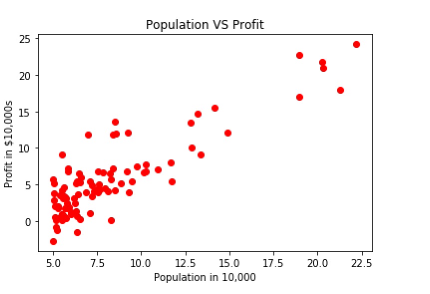
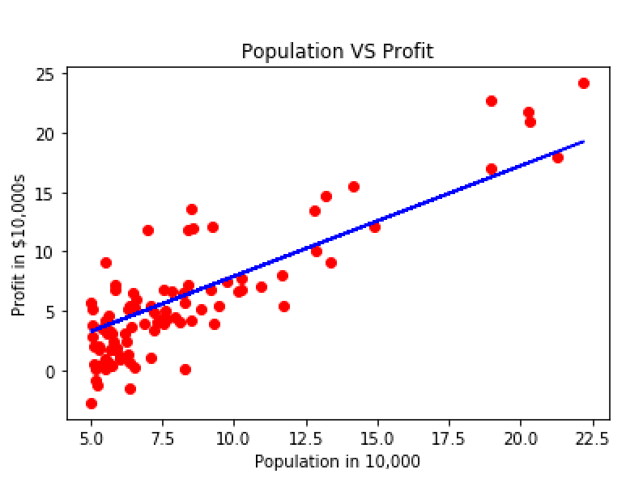

# Assignment 1 : Week 2

##  Warm Up excersise 
Return a 5X5 indentity matrix 
##  Linear Regression with one variable 
1. Plot the data 
2. Add intercept 
3. Calculate cost function at theta=0  
4. Use gradient descent 
5. predict the values for 35000 and 70000
6. plot the line of best fit

 

 

## Multi variable linear regression

The file ex1data2.txt contains a training set of housing prices in Port- land, Oregon.  The first column is the size of the house (in square feet), the second column is the number of bedrooms, and the third column is the price of the house. 

1. Feature Normalization  

 Subtract the mean value of each feature from the dataset. 
 After subtracting the mean, additionally scale (divide) the feature values by their respective “standard deviations.” 

2. Implement Gradient descent  

3. Adjust your learning rate and plot no .of iterations vs cost plot to check if gradient descent is working properly 

4. Apply normal equation to calculate theta.

